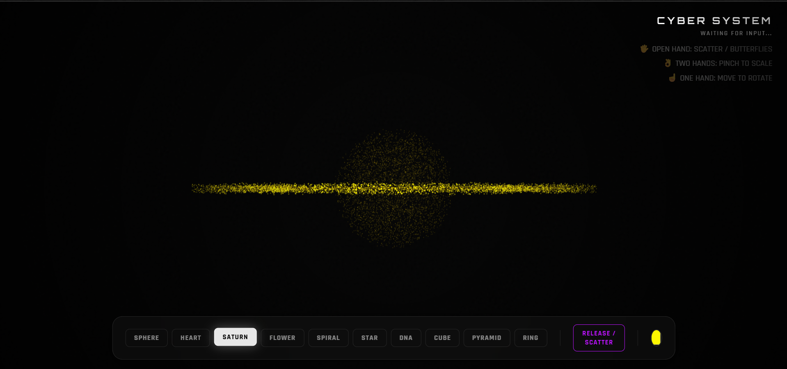

<div align="center">

  # 🌌 GESTURE CONTROLLED PARTICLES
  ### CYBER-PARTICLE-FLUX // 3D INTERACTIVE SYSTEM

  <p>
    <a href="https://github.com/Pethumshyam6611/gesture-controlled-particles">
      
    </a>
    <a href="https://github.com/Pethumshyam6611/gesture-controlled-particles">
      
    </a>
    <a href="https://github.com/Pethumshyam6611/gesture-controlled-particles">
      
    </a>
  </p>

  <br />

  

  <br />
  <br />

  <p align="center">
    <strong>A futuristic holographic interface that turns your hands into controllers.</strong><br>
    Experience 15,000+ particles morphing in real-time using Computer Vision and WebGL.
  </p>

</div>

---

## 🚀 Overview

This project is a web-based **Augmented Reality (AR)** experiment that utilizes **Google MediaPipe** for hand tracking and **Three.js** for high-performance 3D rendering. It creates a "Cyberpunk" aesthetic environment where digital particles react to physical hand gestures.

## ✨ Key Features

* **🖐️ Real-time Hand Tracking:** Latency-free detection of hand joints and gestures.
* **🧬 Shape Morphing:** Seamlessly transition between shapes like Sphere, DNA Helix, Heart, Saturn, and Pyramids.
* **🦋 Scatter Effect:** Open your palm to turn particles into glowing butterflies.
* **🤏 Interactive Scaling:** Use two hands (pinch gesture) to zoom in and out of the 3D model.
* **🎨 Neon Aesthetics:** Cyber-themed UI with glassmorphism and glow effects.

---

## 🎮 How to Control

| Gesture | Action | Description |
| :--- | :--- | :--- |
| **Open Palm** 🖐️ | **Scatter / Release** | Particles break formation and turn into butterflies. |
| **Two Hands** 🙌 | **Scale / Zoom** | Move hands apart to enlarge, bring closer to shrink. |
| **One Hand Move** ☝️ | **Rotate** | Move a single hand horizontally to rotate the object. |
| **Buttons** 🖱️ | **Shape Change** | Click UI buttons to morph into different geometries. |

---

## 🛠️ Tech Stack

* **Three.js** - 3D Rendering Engine
* **MediaPipe Hands** - Machine Learning Hand Tracking
* **HTML5 / CSS3** - UI & Glassmorphism Effects
* **JavaScript (ES6+)** - Logic & Animation Loop

---

## ⚡ Quick Start

1.  **Clone the repository**
    ```bash
    git clone [https://github.com/Pethumshyam6611/gesture-controlled-particles.git](https://github.com/Pethumshyam6611/gesture-controlled-particles.git)
    ```

2.  **Navigate to the project**
    ```bash
    cd gesture-controlled-particles
    ```

3.  **Run the project**
    * Simply open `index.html` in your browser.
    * *Recommended:* Use "Live Server" extension in VS Code for better performance.

---

## 👨‍💻 Author

**Pethum Shyam**
* Software Engineer Intern
* GitHub: [@Pethumshyam6611](https://github.com/Pethumshyam6611)

---

<div align="center">
  <sub>Built with ❤️ and a lot of particles.</sub>
</div>
